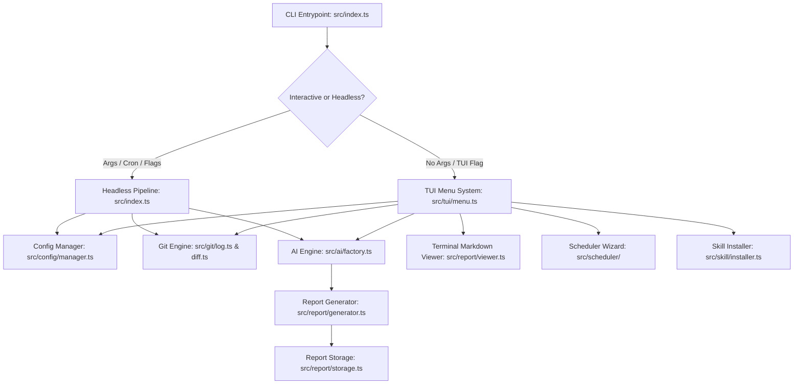

# Ingest Architecture Specification

This document describes the architectural layers, module responsibilities, and data flows of `ingest`.

## 1. System Overview

`ingest` is an AI-first developer tool that inspects Git repository histories, performs multi-commit AI analysis, generates structured markdown reports, and offers an interactive zero-dependency terminal UI and automated scheduling suite.

---

## 2. Module Responsibilities

### 2.1. `src/config/`
- **`types.ts`**: Formal schemas for `AppConfig`, `RepoConfig`, `LocalRepoConfig`, `ProviderConfigMap`, `RawConfig`, and `ReportStyle` (including `diff_ignore_patterns`, `smart_diff_filter`, `diff_mode`, `max_diff_lines`, `report_style` presets, and `retention_days` expiration settings).
- **`parser.ts`**: Pure zero-dependency JSONC parser supporting single-line `//`, block `/* ... */` comments, and trailing commas.
- **`manager.ts`**: Implements hierarchical configuration loading. Discovers global defaults (`~/.config/ingest/config.jsonc`) and local per-repository configurations (`.ingestrc`, `ingest.config.jsonc`, `.ingest.json`), merges overrides gracefully, and supports persistent updates.
- **`init.ts`**: Interactive and quick configuration initialization wizard (`ConfigInitWizard`). Guides developers through AI provider selection, branch discovery, prompt presets (Engineering Deep Dive, System-Centric Architecture, Changelog, Security), diff limits, report storage & retention, and optional scheduler installation.

### 2.2. `src/git/`
- **`runner.ts`**: Safe `git` command execution using `child_process.spawn`. Handles path resolution, detects whether a directory is a valid git repository, lists local/remote branches, infers canonical repository names (via Git remote origin URLs, worktree common directories, or folder paths), and exports reference comparison utilities (`getCommitsBetweenRefs`, `parseCompareRange`).
- **`log.ts`**: Queries Git commit history across specified branches within flexible time windows and custom date ranges (`--date <start>..<end>`, `--since`, `--until`), or between arbitrary Git references/branches/tags (`getCommitsBetweenRefs`, `parseCompareRange`), extracting author names, emails, hashes, commit subjects, and file change lists.
- **`diff.ts`**: Analyzes repository file stats (`git diff --stat`) and patch excerpts for deep-dive AI context, including ref-to-ref comparisons (`fetchDiffStatBetweenRefs`, `fetchDiffPatchesBetweenRefs`, `fetchDiffBetweenRefs`). Implements smart diff filtering (`DEFAULT_NOISY_PATTERNS` for lockfiles, bundles, sourcemaps, compiler metadata, media/binary assets, snapshots), user-defined ignore globs (`diff_ignore_patterns`), filter toggle (`smart_diff_filter`), and architectural signal prioritization (`getFilePriority`) that prioritizes manifests, entrypoints, and core source over secondary artifacts when truncating to line budgets.

### 2.3. `src/ai/`
- **`types.ts`**: Common interfaces for `AIProvider`, `AnalysisContext`, `AnalysisResult`, and `TokenUsage`.
- **`discovery.ts`**: Dynamic agent harness registry and real-time PATH probing engine (`HarnessDiscovery`). Automatically detects available CLI tools (`agy`, `claude`, `codex`, `pi`, `opencode`, `gemini`, `ollama`, `aider`, `gh copilot`) with status badges and smart defaults.
- **`tokens.ts`**: Token parsing and formatting utility. Parses exact token metadata from report footers and formats token counts with `N/A` fallback for unrecorded reports.
- **`repair.ts`**: AI-powered Mermaid syntax repair and healing engine. Fixes unquoted node labels, illegal node IDs, broken connector arrows, and converts unformatted architecture blocks into valid `flowchart TD` diagrams.
- **`prompt.ts`**: Generates high-fidelity structured prompts with multi-style layout engines (`buildStandardAnalysisPrompt`, `buildSystemCentricPrompt`). Implements progressive disclosure (30-second summary, 5-minute briefing with codebase map, causal Problem->Change->Result breakdowns, behavior changes table, and commit appendix).
- **`antigravity.ts`**: Primary provider adapter for Antigravity CLI (`agy --print --output-format json --dangerously-skip-permissions`).
- **`claude.ts`**: Provider adapter for Anthropic Claude Code CLI (`claude -p`).
- **`codex.ts`**: Provider adapter for OpenAI Codex CLI (`codex exec`).
- **`pi.ts`**: Provider adapter for Pi Minimalist Coding Agent (`pi -p`).
- **`opencode.ts`**: Provider adapter for Opencode CLI / local OpenAI-compatible endpoints.
- **`ollama.ts`**: Provider adapter for Ollama local LLM runner (`ollama run`).
- **`aider.ts`**: Provider adapter for Aider pair programming assistant (`aider --message`).
- **`gemini-cli.ts`**: Provider adapter alias for backward compatibility.
- **`custom.ts`**: Provider adapter for custom user-defined commands and executable harnesses.
- **`factory.ts`**: Instantiates and selects the appropriate provider based on active configuration.

### 2.4. `src/report/`
- **`generator.ts`**: Formats structured analysis output into clean GitHub-Flavored Markdown with exact token counts and branch context in the metadata footer.
- **`storage.ts`**: Resolves report file paths (`<output_root>/<repo_name>/YYYY-MM-DD[-<branch>][-<style>]-summary.md`), creates missing directories, scans past reports with token usage and branch metadata (`listReports`), parses branch and style filename variants (`parseReportFileName`), lists repositories (`listRepositories`), and prunes expired reports based on configured retention window (`cleanExpiredReports`).
- **`graph.ts`**: Zero-dependency 2D Unicode & ANSI graph layout engine. Implements topological ranking, character matrix plotting, box-drawing, corner routing, and branch arrow rendering for Mermaid flowcharts directly in terminal character grids.
- **`viewer.ts`**: Zero-dependency terminal markdown renderer with ANSI syntax highlighting, responsive table cell wrapping, and dual-mode diagram formatting (2D box flow vs structured component map).

### 2.5. `src/server/`
- **`server.ts`**: Zero-dependency HTTP server (`node:http`) powering the `--ui` Web Dashboard. Exposes REST endpoints (`/api/status`, `/api/repos`, `/api/reports`, `/api/report`, `POST /api/fix-mermaid`) to browse reports and heal Mermaid diagram syntax on demand.
- **`html.ts`**: Embedded responsive Single Page Application (HTML/CSS/JS) with live repo filtering, timeline report selector, zero-dependency Markdown renderer, diff syntax styling, interactive Mermaid diagram viewer with AI repair (`✨ Fix Diagrams`), token usage badges, copy-to-clipboard, and keyboard navigation (`/`, `c`, `f`).

### 2.6. `src/scheduler/`
- **`types.ts`**: Types for job configurations, frequency (daily, hourly, weekly, custom cron), expiration (`expiresAt`, `expireDays`), and status (`isExpired`).
- **`cron.ts`**: Manages user crontab entries with managed block markers (`# BEGIN INGEST` / `# END INGEST`) and optional expiration tracking (`--expire-schedule`).
- **`launchd.ts`**: Generates and manages macOS LaunchAgents (`~/Library/LaunchAgents/com.tsuzuku.ingest.plist`) with optional expiration tracking.
- **`status.ts`**: Beautiful ANSI-styled card and box formatter for scheduler status across CLI and interactive TUI, displaying remaining days or expiration badges.

### 2.7. `src/skill/`
- **`installer.ts`**: Discovers and deploys the `ingest` AI skill into `~/.gemini/config/skills/ingest/` (or workspace `.agents/skills/`) so AI coding assistants can immediately assist users.

### 2.8. `src/tui/`
- **`ansi.ts`**: ANSI color codes, text formatting, line drawing, and cursor manipulation.
- **`prompt.ts`**: Zero-dependency interactive prompts: single select (arrow keys), text input with Tab path autocompletion (`~`, relative `./`, `../`, absolute `/`, directory `/` appending), and confirmation modals with seamless `Esc` back/cancel support.
- **`pager.ts`**: Scrollable terminal pager supporting `Up`/`Down`, `PageUp`/`PageDown`, `Home`/`End`, and `q`/`Esc` to exit or return.
- **`menu.ts`**: Interactive TUI orchestration loop providing fluid `Esc` back navigation across all menus, submenus, and wizards without intrusive confirmation prompts.
