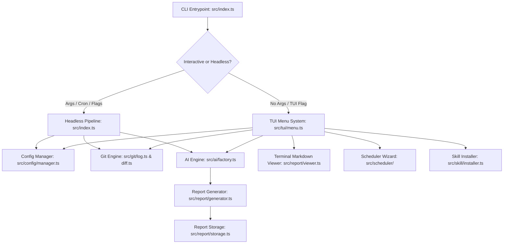

# Ingest Architecture Specification

This document describes the architectural layers, module responsibilities, and data flows of `ingest`.

## 1. System Overview

`ingest` is an AI-first developer tool that inspects Git repository histories, performs multi-commit AI analysis, generates structured markdown reports, and offers an interactive zero-dependency terminal UI and automated scheduling suite.

---

## 2. Module Responsibilities

### 2.1. `src/config/`
- **`types.ts`**: Formal schemas for `AppConfig`, `RepoConfig`, `LocalRepoConfig`, `ProviderConfigMap`, and `RawConfig` (including `retention_days` expiration settings).
- **`parser.ts`**: Pure zero-dependency JSONC parser supporting single-line `//`, block `/* ... */` comments, and trailing commas.
- **`manager.ts`**: Implements hierarchical configuration loading. Discovers global defaults (`~/.config/ingest/config.jsonc`) and local per-repository configurations (`.ingestrc`, `ingest.config.jsonc`, `.ingest.json`), merges overrides gracefully, and supports persistent updates.
- **`init.ts`**: Interactive and quick configuration initialization wizard (`ConfigInitWizard`). Guides developers through AI provider selection, branch discovery, prompt presets, diff limits, report storage & retention, and optional scheduler installation.

### 2.2. `src/git/`
- **`runner.ts`**: Safe `git` command execution using `child_process.spawn`. Handles path resolution, detects whether a directory is a valid git repository, lists local/remote branches, and infers canonical repository names (via Git remote origin URLs, worktree common directories, or folder paths).
- **`log.ts`**: Queries Git commit history across specified branches within flexible time windows and custom date ranges (`--date <start>..<end>`, `--since`, `--until`), extracting author names, emails, hashes, commit subjects, and file change lists.
- **`diff.ts`**: Analyzes repository file stats (`git diff --stat`) and patch excerpts for deep-dive AI context.

### 2.3. `src/ai/`
- **`types.ts`**: Common interfaces for `AIProvider`, `AnalysisContext`, and `AnalysisResult`.
- **`prompt.ts`**: Generates high-fidelity structured prompts. Merges default system instructions with per-repo prompt overrides and diff analytics.
- **`antigravity.ts`**: Primary provider adapter for Antigravity CLI (`agy --print --dangerously-skip-permissions`).
- **`opencode.ts`**: Provider adapter for Opencode CLI / local OpenAI-compatible endpoints.
- **`gemini-cli.ts`**: Provider adapter alias for backward compatibility.
- **`factory.ts`**: Instantiates and selects the appropriate provider based on active configuration.

### 2.4. `src/report/`
- **`generator.ts`**: Formats structured analysis output into clean GitHub-Flavored Markdown.
- **`storage.ts`**: Resolves report file paths (`<output_root>/<repo_name>/YYYY-MM-DD-summary.md`), creates missing directories, scans past reports, and prunes expired reports based on configured retention window (`cleanExpiredReports`).
- **`viewer.ts`**: Zero-dependency terminal markdown renderer with ANSI syntax highlighting and a keyboard-navigable scroll pager.

### 2.5. `src/scheduler/`
- **`types.ts`**: Types for job configurations, frequency (daily, hourly, weekly, custom cron), expiration (`expiresAt`, `expireDays`), and status (`isExpired`).
- **`cron.ts`**: Manages user crontab entries with managed block markers (`# BEGIN INGEST` / `# END INGEST`) and optional expiration tracking (`--expire-schedule`).
- **`launchd.ts`**: Generates and manages macOS LaunchAgents (`~/Library/LaunchAgents/com.tsuzuku.ingest.plist`) with optional expiration tracking.
- **`status.ts`**: Beautiful ANSI-styled card and box formatter for scheduler status across CLI and interactive TUI, displaying remaining days or expiration badges.

### 2.6. `src/skill/`
- **`installer.ts`**: Discovers and deploys the `ingest` AI skill into `~/.gemini/config/skills/ingest/` (or workspace `.agents/skills/`) so AI coding assistants can immediately assist users.

### 2.7. `src/tui/`
- **`ansi.ts`**: ANSI color codes, text formatting, line drawing, and cursor manipulation.
- **`prompt.ts`**: Zero-dependency interactive prompts: single select (arrow keys), text input with Tab path autocompletion (`~`, relative `./`, `../`, absolute `/`, directory `/` appending), and confirmation modals with seamless `Esc` back/cancel support.
- **`pager.ts`**: Scrollable terminal pager supporting `Up`/`Down`, `PageUp`/`PageDown`, `Home`/`End`, and `q`/`Esc` to exit or return.
- **`menu.ts`**: Interactive TUI orchestration loop providing fluid `Esc` back navigation across all menus, submenus, and wizards without intrusive confirmation prompts.
